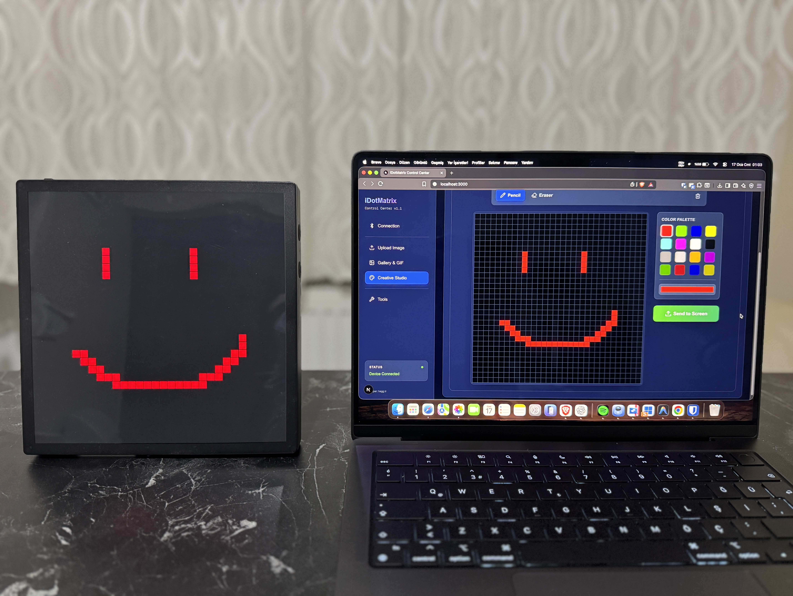
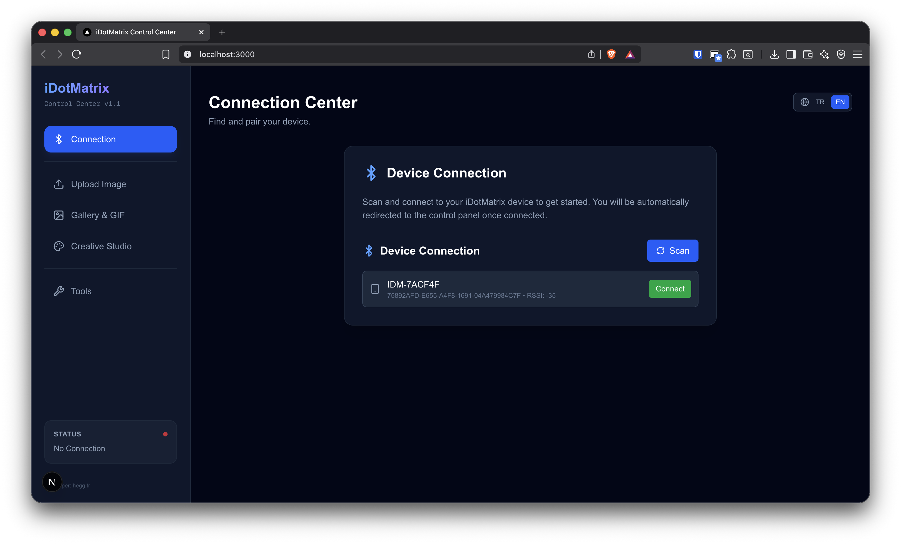
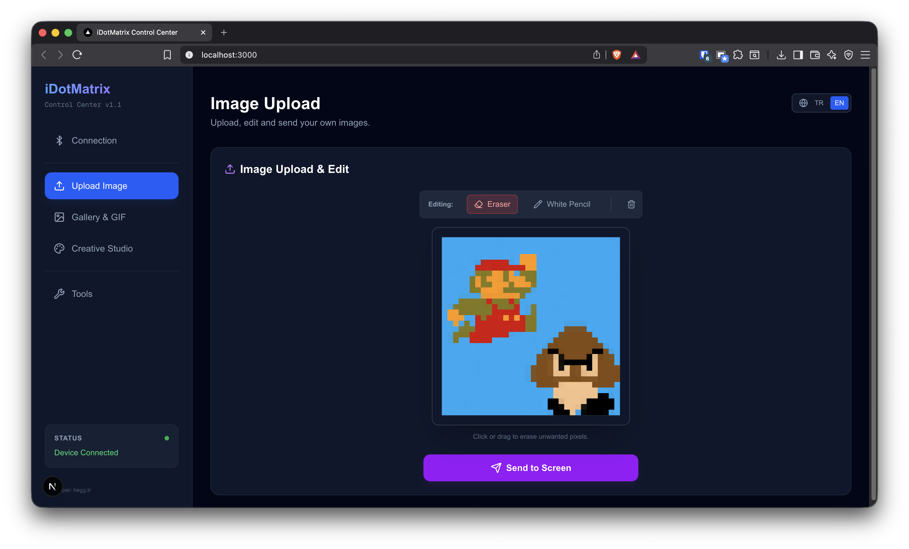
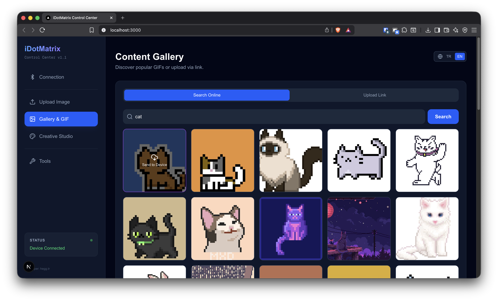
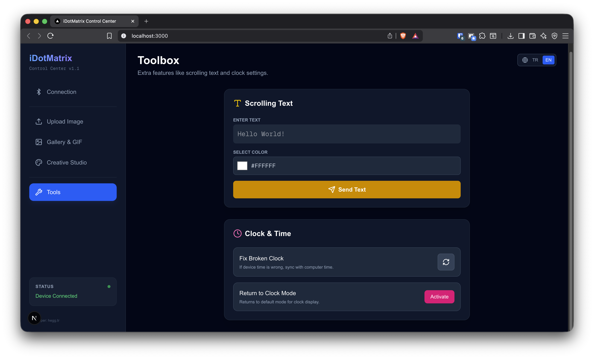

<div align="center">
  
# 🎮 iDotMatrix Web Control

### Bluetooth LED Ekranınızı Web'den Kontrol Edin

[](README.md)
[](README_EN.md)

**iDotMatrix 32x32 LED ekranınız için modern, kullanıcı dostu web arayüzü.**

</div>

---

## 🌟 Proje Hakkında

iDotMatrix Web Control, popüler iDotMatrix 32x32 piksel LED ekranları kontrol etmek için geliştirilmiş açık kaynaklı bir web uygulamasıdır.

Bluetooth bağlantısı üzerinden çalışan bu uygulama ile:

- **Kendi görsellerinizi** yükleyebilir ve düzenleyebilirsiniz
- **İnternetten GIF** arayabilir ve tek tıkla gönderebilirsiniz
- **Piksel sanatı** çizebilir veya emojileri piksele dönüştürebilirsiniz
- **Kayan yazı** gönderebilir ve saat ayarlarını yönetebilirsiniz

Python backend ve Next.js frontend ile modern bir mimari kullanır. Hem Windows hem de Mac/Linux sistemlerinde çalışır.

---

<div align="center">
  
  &nbsp;&nbsp;
  
  <br/>
  <sub><i>Yaratıcı Stüdyo ile çizim yapın • Kendi görsellerinizi yükleyin</i></sub>
</div>

---

## ✨ Özellikler

| Özellik                  | Açıklama                                                       |
| ------------------------ | -------------------------------------------------------------- |
| 🔗 **Kolay Bağlantı**    | Bluetooth cihazınızı tek tıkla tarayın ve bağlanın             |
| 🖼️ **Görsel Yükleme**    | Kendi resimlerinizi yükleyin, düzenleyin ve gönderin           |
| 🎬 **GIF Desteği**       | Animasyonlu GIF'leri internetten arayın veya link ile yükleyin |
| 🎨 **Piksel Editörü**    | 32x32 piksel sanatı çizin ve anında cihaza gönderin            |
| 😊 **Emoji Dönüştürücü** | Emojileri piksel sanatına çevirin                              |
| 📝 **Kayan Yazı**        | Özel metinlerinizi ekrana akıtın                               |
| ⏰ **Saat Ayarları**     | Cihaz saatini senkronize edin                                  |
| 🌍 **Çoklu Dil**         | Türkçe ve İngilizce arayüz desteği                             |

---

## 📸 Ekran Görüntüleri

<details open>
<summary><b>🔌 Cihaz Bağlantısı</b></summary>
<br/>

<p><i>Bluetooth cihazları otomatik taranır. Listeden cihazınızı seçip tek tıkla bağlanın.</i></p>
</details>

<details>
<summary><b>📤 Görsel Yükleme</b></summary>
<br/>

<p><i>PNG, JPG veya GIF dosyalarını yükleyin. Otomatik olarak 32x32 piksele dönüştürülür. Silgi aracıyla istenmeyen pikselleri temizleyebilirsiniz.</i></p>
</details>

<details>
<summary><b>🎬 Galeri & GIF Arama</b></summary>
<br/>

<p><i>İnternette GIF arayın veya herhangi bir resim linkini yapıştırarak doğrudan cihaza yükleyin.</i></p>
</details>

<details>
<summary><b>🛠️ Araç Kutusu</b></summary>
<br/>

<p><i>Kayan yazı gönderin, cihaz saatini senkronize edin veya saat moduna dönün.</i></p>
</details>

---

## 🚀 Kurulum

### Hızlı Başlat (Önerilen)

**iDotMatrix Manager** aracı ile tek tıkla başlatın:

| Platform      | Komut                                          |
| ------------- | ---------------------------------------------- |
| **Windows**   | `run_windows.bat` dosyasına çift tıklayın      |
| **Mac/Linux** | Terminal'de `./run_mac.sh` komutunu çalıştırın |

Bu araç hem Backend hem Frontend sunucularını otomatik açar ve tarayıcıyı başlatır.

### Manuel Kurulum

<details>
<summary><b>🔧 Geliştirici Kurulumu</b></summary>

#### Backend

```bash
cd backend
python -m venv venv
source venv/bin/activate  # Mac/Linux
# veya Windows için: .\venv\Scripts\activate
pip install -r requirements.txt
uvicorn app.main:app --reload
```

#### Frontend

```bash
cd frontend
npm install
npm run dev
```

Ardından tarayıcınızda `http://localhost:3000` adresini açın.

</details>

---

## 🏗️ Teknolojiler

| Katman       | Teknoloji                                       |
| ------------ | ----------------------------------------------- |
| **Frontend** | Next.js 16, React 19, TailwindCSS, Lucide Icons |
| **Backend**  | Python, FastAPI, SimplePyBLE                    |
| **Protokol** | Bluetooth Low Energy (BLE)                      |

---

## 🙏 Teşekkürler

Bu proje, **[8none1/idotmatrix](https://github.com/8none1/idotmatrix)** deposundaki tersine mühendislik çalışmalarından ilham alınarak geliştirilmiştir.

Orijinal protokol notları: [docs/PROTOCOL_NOTES.md](docs/PROTOCOL_NOTES.md)

---

## 📄 Lisans

[MIT](LICENSE) © 2026
